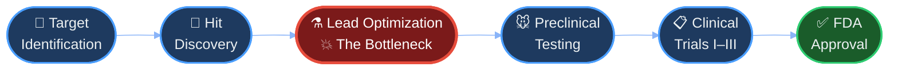
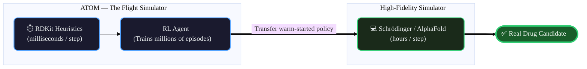
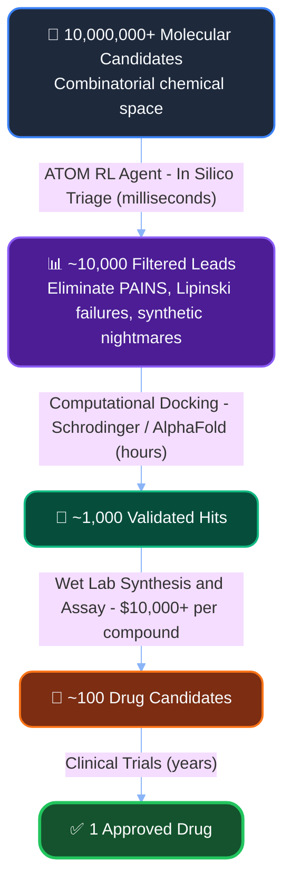
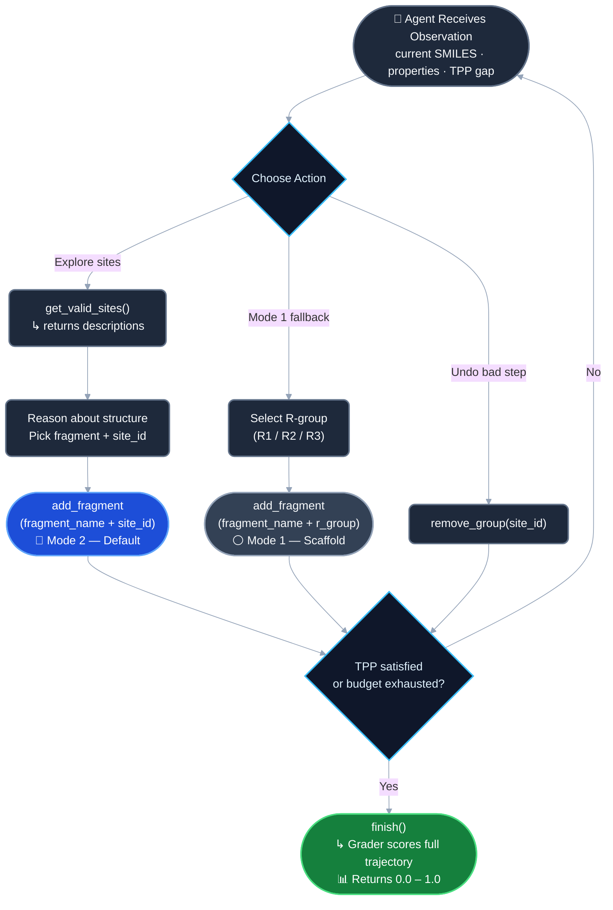
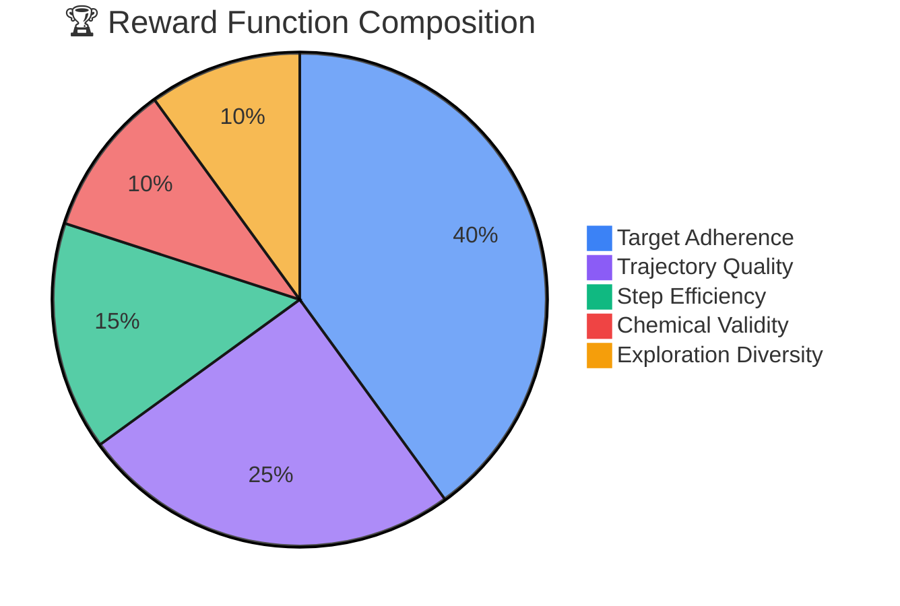
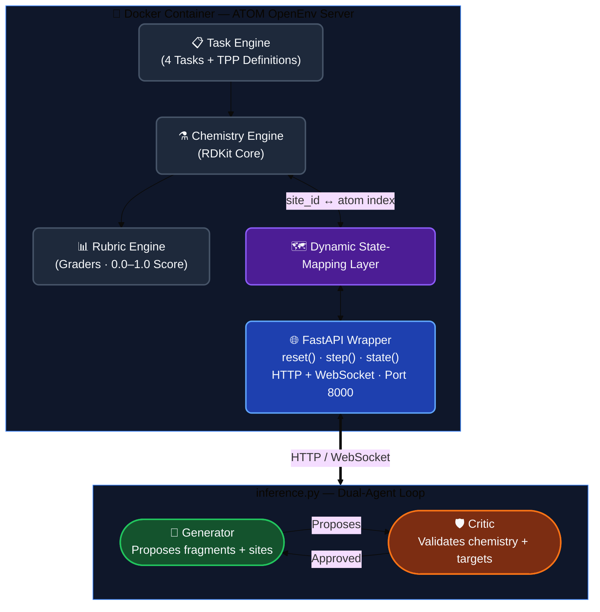

<div align="center">
  

# A.T.O.M. — Agentic Trajectories for Optimizing Molecules

> **A real-world OpenEnv reinforcement learning environment for training, evaluating, and benchmarking LLM agents on multi-objective medicinal chemistry and drug lead optimization.**

[](https://github.com/meta-pytorch/OpenEnv)
[](https://python.org)
[](https://rdkit.org)
[](https://huggingface.co/spaces/)
[](https://docker.com)
[](#pre-submission-checklist)
[](#license)

<br/>

**Hackathon:** [Meta PyTorch OpenEnv Hackathon 2026](https://www.scaler.com/school-of-technology/meta-pytorch-hackathon) × Scaler School of Technology
**Framework:** [OpenEnv](https://github.com/meta-pytorch/OpenEnv) by Meta & Hugging Face
**Team:** A.T.O.M.

</div>

---

## Table of Contents

1. [The Problem — Why This Matters](#the-problem--why-this-matters)
2. [Why ATOM Has Real-World Value](#why-atom-has-real-world-value)
3. [What Is ATOM?](#what-is-atom)
4. [Key Innovations & Environment Design](#key-innovations--environment-design)
5. [OpenEnv Spec Compliance](#openenv-spec-compliance)
6. [Action Space](#action-space)
7. [Observation Space](#observation-space)
8. [Curated Fragment Library](#curated-fragment-library)
9. [Tasks & Graders (Easy → Extreme & Dynamic)](#tasks--graders-easy--medium--hard)
10. [Reward Function Design](#reward-function-design)
11. [System Architecture](#system-architecture)
12. [Quick Start & Setup](#quick-start--setup)
13. [Running the Baseline Inference Script](#running-the-baseline-inference-script)
14. [Docker & Hugging Face Space Deployment](#docker--hugging-face-space-deployment)
15. [Baseline Scores](#baseline-scores)
16. [Repository Structure](#repository-structure)
17. [Infrastructure Compliance](#infrastructure-compliance)
18. Pre-Submission Checklist & Evaluation Criteria *(collapsible — see bottom of page)*
19. [Acknowledgements](#acknowledgements)
20. [License](#license)

---

## The Problem — Why This Matters

Bringing a single new drug to market costs an average of **$2.6 billion** and takes **10–15 years**. The overwhelming majority of candidate molecules fail during the preclinical pipeline — not because the initial "hit" compound was poor, but because the subsequent **Lead Optimization** phase is exceptionally difficult.

Lead Optimization is where computational and medicinal chemists iteratively refine a promising molecule to simultaneously satisfy multiple, often competing, property requirements: increase binding affinity to the target protein while maintaining aqueous solubility, lower toxicity risk, ensure the molecule can be synthesized at scale, and keep the molecular weight within drug-like ranges. This is a textbook **Multi-Parameter Optimization (MPO)** problem across a combinatorial chemical space estimated at 10⁶⁰ possible drug-like molecules.

Current AI approaches to molecular generation (VAEs, GANs, diffusion models) typically operate in a one-shot setting — generate a molecule, score it, repeat. They rarely model the *sequential decision-making* process that real chemists follow: observe current properties, hypothesize a modification, apply it, evaluate the result, and iterate. This is precisely the setting where reinforcement learning excels, and precisely the gap ATOM fills.

**This is not a toy problem.** Lead optimization is a genuine, high-stakes industrial task performed daily by thousands of pharmaceutical scientists worldwide. An AI agent that can navigate this space competently would have immediate, tangible value for drug discovery pipelines.



> 💰 **$2.6 billion** · ⏳ **10–15 years** · 💔 **>90% attrition rate** at Lead Optimization

---

## Why ATOM Has Real-World Value

> *A common question: if RDKit-derived heuristics like QED and LogP are imperfect proxies for biological activity, what makes ATOM scientifically meaningful? The answer lies in understanding what ATOM is actually designed to do — and what it is not.*

### 1. A Flight Simulator for AI Policy Training

Running a genuine biophysical simulation — computing how a candidate molecule docks inside a target protein's binding pocket using tools like Schrödinger Suite or AlphaFold-derived structural models — can take hours to days of supercomputer time per molecule. At that cost, it is computationally infeasible to train a reinforcement learning agent: the agent needs to complete millions of environment interactions before its policy converges.

ATOM occupies the role of the flight simulator. RDKit computes molecular properties in milliseconds, giving the RL agent a low-cost arena to practice the *strategy* of medicinal chemistry — learning how to navigate competing trade-offs, when to add a polar group versus a halogen, how to balance lipophilicity against molecular weight — without burning supercomputer hours. Once a robust policy is trained inside ATOM, it can be transferred into high-fidelity biophysical simulators as a warm-started prior, dramatically reducing the time that expensive hardware needs to refine it. The simulator isn't the destination; it's how you learn to fly before you touch the real aircraft.



### 2. In Silico Triage — Filtering the Discovery Funnel

Real pharmaceutical drug discovery begins with a combinatorial chemical space that can exceed tens of millions of candidate structures. Wet-lab synthesis and assay of even a small fraction of those candidates is economically impossible — a single compound can cost thousands of dollars to synthesize and test.

The industry solution is a staged funnel: computational filters progressively eliminate the least promising candidates before any physical chemistry is performed. An RL agent trained inside ATOM can serve as one such filter. Because its optimization loop runs entirely in software, it can sweep large swaths of chemical space and discard molecules that are demonstrably too heavy, too lipophilic, synthetically intractable, or structurally flagged by PAINS alerts — all before a single gram of reagent is purchased. The molecules that survive this *in silico* triage are materially better candidates for the expensive downstream stages.



### 3. A Standardized Benchmark for Scientific Reasoning

There is currently no canonical benchmark for evaluating whether a language model can reason about complex, multi-objective scientific planning problems. General-purpose benchmarks test mathematical reasoning (GSM8K) or code generation (HumanEval), but neither captures the kind of spatial, causal, and trade-off reasoning that scientific work demands.

ATOM provides that surface. Because the graders are deterministic and produce continuous scores on a [0.0, 1.0] scale, a laboratory can run any two models against the same four tasks and obtain a numerically rigorous comparison of their scientific reasoning capability — independent of any real drug outcome. A model that scores 0.8 on Task 3 has demonstrably better multi-objective planning behavior than one that scores 0.5, in a way that is reproducible and auditable.

### The Architecture Is the Value

ATOM is deliberately constructed around the OpenEnv standard, which means its scoring functions are modular. The RDKit-based graders used here are a functional default — not a constraint. A pharmaceutical company integrating ATOM into their pipeline can replace those graders with their own proprietary assay data, protein-ligand binding predictors, or ADMET models, and immediately inherit a trained agent that already understands the strategic structure of the optimization problem. The policy transfers; only the oracle changes. This pluggability is what makes ATOM an infrastructure investment rather than a one-off experiment.

---

## What Is ATOM?

ATOM (**A**gentic **T**rajectories for **O**ptimizing **M**olecules) is an OpenEnv-compliant reinforcement learning environment that simulates the drug lead optimization workflow. It provides an isolated, highly structured execution sandbox — powered by the open-source cheminformatics toolkit **RDKit** — where LLM agents act as autonomous medicinal chemists.

Agents interact with ATOM through the standard OpenEnv Gymnasium-style API (`step()`, `reset()`, `state()`). At each step, the agent observes the current molecule's computed properties, selects a chemical modification from a curated fragment library, chooses a specific attachment site on the molecular scaffold, and receives feedback on whether the modification moved the molecule closer to (or further from) the Target Product Profile (TPP).

ATOM is designed to be:

- **Real-world:** Models a genuine pharmaceutical industry task, not a game or abstract puzzle.
- **Structured:** Typed Pydantic models for all actions, observations, and rewards — fully spec-compliant.
- **Curriculum-friendly:** Four tasks of escalating difficulty (easy → medium → hard → extreme) with deterministic, reproducible graders.
- **Reward-rich:** A trajectory-aware scoring rubric that provides meaningful partial-progress signal at every step, not just sparse binary end-of-episode feedback.
- **Deployable:** Fully containerized with Docker, deployable to Hugging Face Spaces, and validated via `openenv validate`.

```mermaid
%%{init: { 'sequence': {'theme': 'base', 'actorBkg': '#1e293b', 'actorBorder': '#3b82f6', 'actorTextColor': '#f8fafc', 'noteBkg': '#334155', 'noteTextColor': '#f8fafc', 'noteBorder': '#475569', 'messageColor': '#e2e8f0'} } }%%
sequenceDiagram
    autonumber
    actor Agent as 🧠 LLM Agent
    participant ATOM as ⚛️ ATOM Server
    participant RDKit as 🔬 RDKit Engine
    participant Grader as 📊 Rubric Engine

    Agent->>+ATOM: reset(task_id)
    ATOM-->>-Agent: Observation (scaffold SMILES + Target Product Profile)

    rect rgb(30, 41, 59)
    loop Optimization Episode
        Agent->>+ATOM: step(get_valid_sites)
        ATOM->>RDKit: Enumerate eligible C-H bonds
        RDKit-->>ATOM: Site list with spatial descriptions
        ATOM-->>-Agent: valid_sites [{site_id, description}]

        Agent->>+ATOM: step(add_fragment, site_id, fragment_name)
        ATOM->>RDKit: Apply modification, validate valency
        RDKit-->>ATOM: Updated molecule + QED / LogP / SA / MW
        ATOM-->>-Agent: Observation (new properties + directional feedback)
    end
    end

    Agent->>+ATOM: step(finish)
    ATOM->>Grader: Score full trajectory
    Grader-->>ATOM: Final score 0.0 – 1.0
    ATOM-->>-Agent: Episode complete + final grade
```



---

## Key Innovations & Environment Design

### 1. Dual-Mode Action Space — Solving "Indexing Hell"

A fundamental challenge in using LLMs for molecular editing is the mismatch between how language models represent structures (as text) and how chemistry toolkits represent them (as indexed atom graphs). Asking an LLM to output raw SMILES strings from scratch leads to chemically invalid molecules in the majority of cases.

ATOM solves this with a **polymorphic, discrete action space** offering two operating modes:

**Mode 2 — Site Enumeration (Default & Advanced):** The agent uses the `get_valid_sites` tool to query the environment for available modification sites (C-H bonds eligible for substitution). The environment returns plain-English spatial descriptions — for example, *"Aromatic carbon, meta to the hydroxyl group"* — rather than raw atom indices. The agent reads the context, reasons about the structural consequences, and selects the optimal topological site by `site_id`. Under the hood, ATOM's **Dynamic State-Mapping Layer** translates the LLM's temporary `site_id` choices into RDKit's shifting internal atom indices after every structural modification. This completely eliminates the "indexing hell" that traditionally plagues graph-based chemistry environments.

**Mode 1 — Scaffold & R-Group (Fallback):** The agent selects predefined attachment vectors (R1, R2, R3) on a fixed core scaffold. This simpler mode is ideal for benchmarking smaller, open-source models that lack the spatial reasoning capacity for Mode 2, and serves as a natural baseline for standard action-selection RL.



### 2. Trajectory-Aware Reward Rubric

Most molecular optimization environments score only the final molecule. ATOM scores the *entire optimization campaign* — the full trajectory of decisions the agent made. A chemist who strategically reaches a target profile in 5 well-reasoned steps should score higher than one who random-walks there in 30. The rubric is detailed in the [Reward Function Design](#reward-function-design) section below.

### 3. Real Cheminformatics, Not String Manipulation

Every molecular modification in ATOM goes through RDKit's validated chemistry engine. This means:

- Chemical valency rules are enforced at every step (no impossible bonds).
- Molecular properties (QED, LogP, SA Score, Molecular Weight) are computed from the actual molecular graph, not estimated.
- PAINS (Pan-Assay Interference Compounds) alerts and Lipinski Rule of 5 violations are detected using standard medicinal chemistry filters.
- The fragment library consists of real building blocks used in pharmaceutical research.

---

## OpenEnv Spec Compliance

ATOM implements the full [OpenEnv interface specification](https://github.com/meta-pytorch/OpenEnv) as defined by Meta and Hugging Face:

| Requirement | ATOM Implementation |
|---|---|
| **Typed Pydantic Models** | `Observation`, `Action`, and `Reward` are fully typed Pydantic models with field-level documentation. |
| **`step(action)`** | Accepts a typed `Action`, applies the chemical modification via RDKit, computes updated properties, returns `(observation, reward, done, info)`. |
| **`reset()`** | Initializes a fresh episode with the task's starting scaffold. Clears all trajectory history, returns the initial `Observation`. |
| **`state()`** | Returns the current episode state including `episode_id`, `step_count`, `current_smiles`, and full property snapshot. |
| **`openenv.yaml`** | Manifest file at the repository root with environment metadata, task definitions, and deployment configuration. |
| **`openenv validate`** | Environment passes the automated pre-submission validation script. |
| **FastAPI Server** | Environment is wrapped in a FastAPI server exposing HTTP/WebSocket endpoints for `reset()`, `step()`, and `state()`. |
| **Docker Containerized** | Working Dockerfile that builds and runs cleanly. Starts the FastAPI server on port 8000. |
| **Hugging Face Space** | Deployed as a containerized HF Space tagged with `openenv`. |
| **Baseline Inference Script** | `inference.py` at the project root, uses the OpenAI API client, reads credentials from environment variables. |

---

## Action Space

At each step, the agent submits a structured action consisting of three fields:

| Field | Type | Description |
|---|---|---|
| `action_type` | `string` | The type of modification. One of: `add_fragment`, `remove_group`, `get_valid_sites`, `finish`. |
| `fragment_name` | `string` (optional) | The name of the fragment to attach (from the curated library). Required for `add_fragment` actions. |
| `site_id` | `integer` (optional) | The target attachment site on the current molecule (returned by `get_valid_sites`). Required for `add_fragment` and `mutate_atom` actions in Mode 2. |
| `r_group` | `string` (optional) | The R-group label (R1, R2, R3) for scaffold-based attachment. Used in Mode 1 only. |
| `target_atom_symbol` | `string` (optional) | The symbol of the new atom (e.g., 'N', 'O', 'C'). Required for `mutate_atom` actions. |

**Action semantics:**

- **`get_valid_sites`** — A read-only query. The environment returns a list of eligible modification sites with human-readable spatial descriptions. No molecular state is changed. This is the agent's primary tool for spatial reasoning in Mode 2.
- **`add_fragment`** — Attaches the specified fragment to the specified site. The environment validates chemical feasibility, applies the modification via RDKit, recomputes all properties, and returns the updated observation.
- **`remove_group`** — Removes a substituent at the specified site, reverting it to a hydrogen. Useful for correcting poor earlier decisions.
- **`mutate_atom`** — Transmutates an atom into a new element (e.g., swapping a Carbon for a Nitrogen), enabling advanced scaffold morphing and ring heteroatom swaps.
- **`finish`** — The agent declares the optimization complete. The trajectory is scored by the grader and the episode ends.

---

## Observation Space

After every `step()`, or when calling `state()`, the agent receives a fully typed JSON observation containing:

| Field | Type | Description |
|---|---|---|
| `current_smiles` | `string` | The SMILES representation of the current molecule. |
| `current_properties` | `object` | Computed molecular properties: `QED` (Quantitative Estimate of Druglikeness, 0.0–1.0), `LogP` (Lipophilicity), `SA_Score` (Synthetic Accessibility, 1.0–10.0), `MW` (Molecular Weight in Da), and `Energy` (3D MMFF94 conformer strain). |
| `target_profile` | `object` | The Target Product Profile for the current task: min/max ranges for each property the agent must satisfy. |
| `message` | `string` | Human-readable feedback from the environment describing the result of the last action (e.g., *"Modification successful. QED improved by +0.05."*, or *"Invalid action: Cannot attach Phenyl ring — would violate valency at site 3."*). |
| `valid_sites` | `array` | List of available modification sites, each with a `site_id` (integer) and a `description` (natural-language spatial context). Only populated after a `get_valid_sites` query. |
| `step_number` | `integer` | The current step within the episode (0-indexed). |
| `max_steps` | `integer` | The maximum number of steps allowed for the current task before auto-termination. |
| `done` | `boolean` | Whether the episode has ended (either by the agent calling `finish`, exceeding `max_steps`, or producing an invalid molecule). |
| `trajectory_summary` | `object` | Running statistics about the optimization trajectory: property deltas per step, monotonicity score, diversity of fragments used. |

---

## Exhaustive Fragment Library

ATOM includes a massive, enterprise-grade curated library of 77 chemical building blocks, covering both organic and inorganic chemistry. These are the building blocks the agent can attach to the molecular scaffold:

| Category | Fragments | Pharmacological Role |
|---|---|---|
| **Halogens** | Fluorine, Chlorine, Bromine, Iodine, Trifluoromethyl, Trifluoromethoxy | Metabolic stability, lipophilicity modulation, bioisosteric replacement |
| **Polar Groups** | Hydroxyl, Amino, Methylamino, Dimethylamino, Carboxyl, Methoxy, Ethoxy, Cyano, Nitro, Formyl, Acetyl, Amide, Sulfonamide, Methylsulfonyl, Tetrazole, Thiol, Methylthio | Aqueous solubility, hydrogen-bond formation, biological mimics |
| **Aliphatics & Cycloalkanes** | Methyl, Ethyl, Propyl, Isopropyl, Butyl, Isobutyl, tert-Butyl, Vinyl, Ethynyl, Cyclopropyl, Cyclobutyl, Cyclopentyl, Cyclohexyl, Oxetane | Steric bulk, lipophilicity, metabolic blocking, conformational restriction |
| **Heterocycles & Fused Rings** | Phenyl, Pyridine, Pyrimidine, Pyrazine, Pyridazine, Pyrrolidine, Piperidine, Piperazine, Morpholine, Tetrahydropyran, Pyrrole, Furan, Thiophene, Imidazole, Pyrazole, Oxazole, Isoxazole, Thiazole, Triazole, Naphthalene, Indole, Benzimidazole, Benzofuran, Benzothiophene, Quinoline, Isoquinoline, Purine | Core geometry extension, target interaction, H-bond acceptor/donor |
| **Inorganic / Metalloids** | BoronicAcid, Silane, Phosphate, Sulfate | Covalent binders, transition state analogs, extreme solubility profiles |

*Note: The ATOM library uses a hybrid procedural generation engine that ensures exhaustive structural coverage (e.g., generating homologous alkyl chains) and rigorously validates every fragment via RDKit Kekulization checks at boot.*

---

## Tasks & Graders (Easy → Extreme & Dynamic)

ATOM implements **four** distinct evaluation tasks with escalating difficulty, plus the ability to create dynamic tasks. Each task defines a concrete objective, a starting scaffold, a Target Product Profile (TPP), and a deterministic programmatic grader that scores agent performance on a continuous `0.0` to `1.0` scale.

```mermaid
%%{init: {'theme': 'base', 'themeVariables': { 'edgeLabelBackground': '#0f172a', 'lineColor': '#94a3b8'}}}%%
flowchart LR
    classDef easy fill:#14532d,stroke:#22c55e,stroke-width:2px,color:#f0fdf4,rx:12,ry:12;
    classDef med fill:#78350f,stroke:#f59e0b,stroke-width:2px,color:#fffbeb,rx:12,ry:12;
    classDef hard fill:#7f1d1d,stroke:#ef4444,stroke-width:2px,color:#fef2f2,rx:12,ry:12;

    T1(["🟢 Task 1 : Single-Property<br/>Benzene → LogP target<br/>5 steps · Baseline: 0.92"]):::easy
    T2(["🟡 Task 2 : Multi-Parameter<br/>LogP + QED balance<br/>8 steps · Baseline: 0.71"]):::med
    T3(["🔴 Task 3 : Full TPP Match<br/>4 properties + PAINS<br/>12 steps · Baseline: 0.38"]):::hard
    T4(["⚫ Task 4 : Build from Scratch<br/>Single Carbon → Complex Drug<br/>20 steps · Baseline: 0.12"]):::hard

    T1 ==>|+ competing objectives| T2
    T2 ==>|+ spatial reasoning and PAINS avoidance| T3
    T3 ==>|+ complete structural invention| T4
```



### Dynamic Tasks (Custom Use Cases)

ATOM supports fully dynamic tasks. Researchers can supply a custom starting scaffold (or use a single atom to build from scratch) and an arbitrary Target Product Profile (TPP) at runtime during environment reset. The grader automatically adapts to score the trajectory against the provided custom use case.

### Task 1 — Single-Property Optimization (Easy)

| Attribute | Detail |
|---|---|
| **Objective** | Modify a simple Benzene scaffold to achieve a target Lipophilicity (LogP) within the range [2.5 – 3.0]. |
| **Starting Scaffold** | Benzene (`c1ccccc1`) |
| **Target Profile** | LogP ∈ [2.5, 3.0] |
| **Max Steps** | 5 |
| **What It Tests** | Basic fragment selection, understanding of how substituents affect lipophilicity, ability to follow instructions. |
| **Grader** | Measures LogP target adherence using a Gaussian proximity function. Penalizes chemically invalid outputs. Full score requires reaching target LogP within the step budget while maintaining chemical validity. Returns `0.0 – 1.0`. |
| **Expected Baseline** | Solvable by most frontier LLMs. Tests fundamental competence. |

### Task 2 — Multi-Parameter Balancing (Medium)

| Attribute | Detail |
|---|---|
| **Objective** | Starting from a moderately lipophilic scaffold, simultaneously reduce LogP (increase aqueous solubility) while maximizing the Quantitative Estimate of Druglikeness (QED > 0.6). |
| **Starting Scaffold** | Toluene derivative (`Cc1ccccc1`) |
| **Target Profile** | LogP ∈ [1.0, 2.5] AND QED ≥ 0.6 |
| **Max Steps** | 8 |
| **What It Tests** | Strategic reasoning about competing objectives — adding polar groups to lower LogP often lowers QED if placed poorly. The agent must balance trade-offs. |
| **Grader** | Evaluates both property targets using weighted Gaussian proximity. Awards bonus for strategic use of hydrophilic fragments (Hydroxyl, Amino) without over-functionalizing. Penalizes Lipinski violations. Returns `0.0 – 1.0`. |
| **Expected Baseline** | Challenging for smaller models. Requires understanding of property trade-offs. |

### Task 3 — Full Target Product Profile Matching (Hard)

| Attribute | Detail |
|---|---|
| **Objective** | Navigate complex chemical space to hit a tight Target Product Profile starting from a suboptimal kinase inhibitor scaffold. Now includes 3D Energy constraints. |
| **Starting Scaffold** | Suboptimal kinase inhibitor (pyrimidine-based, ~350 Da) |
| **Target Profile** | LogP ∈ [2.0, 3.5], QED ≥ 0.65, SA_Score ≤ 4.0, MW ∈ [300, 500], Energy ≤ 150.0 |
| **Max Steps** | 12 |
| **What It Tests** | Full drug-design reasoning: spatial awareness, 3D conformer stability optimization, multi-step planning, awareness of PAINS/BRENK/NIH structural alerts. |
| **Grader** | A strict evaluator combining proximity scoring, alert detection, and Lipinski enforcement. Returns `0.0 – 1.0`. |
| **Expected Baseline** | Difficult even for GPT-4 class models. Requires emergent spatial reasoning. |

### Task 4 — Build From Scratch (Extreme)

| Attribute | Detail |
|---|---|
| **Objective** | Invent an entirely novel, complex drug molecule from scratch (starting with just a single carbon atom) that satisfies a highly challenging multi-objective TPP. |
| **Starting Scaffold** | Single Carbon atom (`C`) |
| **Target Profile** | LogP ∈ [2.0, 4.0], QED ≥ 0.7, SA_Score ≤ 3.5, MW ∈ [250, 400], Energy ≤ 100.0 |
| **Max Steps** | 20 |
| **What It Tests** | Generative chemical invention. The agent must build the core scaffold, attach heterocycles, mutate atoms to morph rings, and satisfy extreme 3D stability constraints without relying on a pre-built drug core. |
| **Expected Baseline** | Extremely difficult. Most models will fail to generate a chemically stable, complex molecule from scratch within the step budget. |

**Grader guarantees:**

- All graders are **deterministic** — the same trajectory always produces the same score.
- All graders are **reproducible** — running the baseline script multiple times yields identical results (given the same model and temperature=0).
- All scores are **continuous floats in [0.0, 1.0]** — never binary pass/fail, never a fixed constant.
- Difficulty progression is meaningful — a model that scores 0.9 on Task 1 may score 0.3 on Task 3.

---

## Reward Function Design

ATOM's reward function is designed to provide **meaningful signal over the full trajectory**, not just sparse end-of-episode feedback. This is critical for RL training — agents need intermediate signals to learn from.

The final episode score is a weighted sum of five components, strictly normalized to a `0.0` to `1.0` float:



| Component | Weight | What It Measures |
|---|---|---|
| **Target Adherence** | 40% | How close the final molecule's properties (QED, LogP, SA Score, MW) are to the Target Product Profile. Uses Gaussian proximity functions centered on target ranges — partial credit for being close, full credit for being within range. |
| **Trajectory Quality** | 25% | Uses an Area-Under-the-Curve (AUC) proxy combined with an inversion penalty. This advanced non-linear heuristic rewards agents for reaching good states early and maintaining them, rather than just hitting the target at the very last step. |
| **Step Efficiency** | 15% | Uses exponential decay. Early completion is highly rewarded, while grinding out to the maximum step limit rapidly approaches zero. This prevents linear RL reward hacking. |
| **Chemical Validity** | 10% | Penalizes PAINS, BRENK, and NIH structural alerts, Lipinski Rule of 5 violations, and chemically invalid intermediates encountered during the trajectory. |
| **Exploration Diversity** | 10% | Rewards using different fragment types and modifying different positions. Penalizes degenerate strategies (e.g., the agent adding methyl groups to every available site). |

**Reward shaping details:**

- **Per-step signal:** After each `step()`, the observation message contains qualitative feedback (*"QED improved by +0.05"* or *"LogP moved away from target"*). The numerical reward is computed at the end of the episode by the grader, but the agent receives directional signal at every step through the observation.
- **Penalization of undesirable behavior:** Infinite loops (repeating the same action), destructive actions (creating invalid molecules), and degenerate strategies all receive explicit score penalties.
- **No reward hacking:** The grader checks for known exploits — e.g., trivially hitting a LogP target by just adding aliphatic chains without considering drug-likeness.

---

## System Architecture

ATOM follows the standard OpenEnv client-server architecture. The environment runs as a FastAPI server inside a Docker container. The inference script communicates with it over HTTP using the OpenAI API client (as required by the hackathon rules).

To solve ATOM's hardest tasks, the baseline `inference.py` implements a **Dual-Agent Architecture** — a Generator agent that proposes chemical modifications, and a Critic agent that validates the proposals against chemical heuristics and target constraints before committing them to the environment.



```text
┌─────────────────────────────────────────────────────────────┐
│                      ATOM OpenEnv Server                    │
│                       (Docker Container)                    │
│                                                             │
│  ┌──────────────┐   ┌───────────────┐   ┌────────────────┐  │
│  │  Task Engine  │──▶│ Chemistry Eng │──▶│ Rubric Engine  │  │
│  │  (4 Tasks /   │   │ (RDKit Core)  │   │ (Graders,      │  │
│  │   TPP Defs)   │   │               │   │  0.0-1.0 Score)│  │
│  └──────────────┘   └───────────────┘   └────────────────┘  │
│                           │ ▲                   │           │
│  ┌────────────────────────▼─┴───────────────────▼────────┐  │
│  │              Dynamic State-Mapping Layer               │  │
│  │       (Translates LLM site_ids ↔ RDKit indices)       │  │
│  └───────────────────────────────────────────────────────┘  │
│                           │ ▲                               │
│  ┌────────────────────────▼─┴────────────────────────────┐  │
│  │             OpenEnv FastAPI Wrapper                    │  │
│  │         reset()  ·  step()  ·  state()                │  │
│  │        (HTTP + WebSocket, Port 8000)                   │  │
│  └───────────────────────────────────────────────────────┘  │
└───────────────────────────┬─▲───────────────────────────────┘
                      HTTP / WebSocket
                            │ │
                   ┌────────▼─┴────────┐
                   │   inference.py    │
                   │  (OpenAI Client)  │
                   │                   │
                   │ ┌───────────────┐ │
                   │ │ 🧠 Generator  │ │  Proposes fragments & sites
                   │ └──────┬────────┘ │
                   │ ┌──────▼────────┐ │
                   │ │ 🛡️ Critic     │ │  Validates valency & targets
                   │ └───────────────┘ │
                   └───────────────────┘
```

**Data flow for a single step:**

1. The inference script calls `reset()` → the server returns the initial observation (starting scaffold, target profile).
2. The Generator agent reads the observation, calls `get_valid_sites` to enumerate modification options.
3. The Generator proposes a fragment + site combination.
4. The Critic validates the proposal against chemical heuristics (will this violate Lipinski? will it create a PAINS alert?).
5. If approved, the inference script calls `step(action)` → the server applies the modification via RDKit, recomputes properties, and returns the updated observation + directional feedback.
6. Repeat until the agent calls `finish` or exceeds `max_steps`.
7. The Rubric Engine scores the full trajectory → returns the final `0.0–1.0` grade.

---

## Quick Start & Setup

### Prerequisites

- Python 3.10 or higher
- Docker (for containerized deployment)
- An LLM API endpoint (OpenAI-compatible)

### 1. Clone and Install

Clone the repository and install the server dependencies. ATOM uses RDKit for cheminformatics, which is included in the requirements.

```bash
git clone https://github.com/YOUR_ORG/ATOM.git
cd ATOM
pip install -r server/requirements.txt
```

### 2. Run the OpenEnv Server Locally

Start the FastAPI server for manual API testing or development:

```bash
uvicorn server.app:app --host 0.0.0.0 --port 8000
```

Once running, the server exposes:

| Endpoint | Method | Description |
|---|---|---|
| `/reset` | POST | Initialize a new episode, returns initial observation |
| `/step` | POST | Submit an action, returns updated observation + reward |
| `/state` | GET | Returns current episode state |
| `/health` | GET | Health check (returns 200 if server is running) |

---

## Running the Baseline Inference Script

The baseline inference script is located at the project root as `inference.py` (as required by the hackathon). It uses the **OpenAI API client** for all LLM calls and reads credentials from environment variables.

### Required Environment Variables

| Variable | Description | Example |
|---|---|---|
| `API_BASE_URL` | The API endpoint for the LLM | `https://api.openai.com/v1` |
| `MODEL_NAME` | The model identifier to use for inference | `gpt-4o` |
| `HF_TOKEN` | Your Hugging Face / API key | `hf_xxxxx` |

> **Note:** `HF_TOKEN` is passed as the `api_key` argument to the standard `OpenAI` client (i.e., `client = OpenAI(base_url=API_BASE_URL, api_key=HF_TOKEN)`), per hackathon instructions. The OpenAI client requires a non-empty `api_key` field even when authenticating against a non-OpenAI endpoint.

### Running the Script

```bash
export API_BASE_URL="<your_llm_endpoint>"
export MODEL_NAME="<target_model>"
export HF_TOKEN="<your_hf_token>"

python inference.py
```

The script will:

1. Start the ATOM OpenEnv server (or connect to a running instance).
2. Execute the Dual-Agent (Generator + Critic) loop against all 4 tasks sequentially.
3. Print per-task scores and a final aggregate score to stdout.
4. Complete within the 20-minute runtime limit (typically ~6 minutes for all 4 tasks).

The inference script defaults to **Mode 2 (Site Enumeration)** for maximum score potential. To run in Mode 1 (Scaffold & R-Group) for simpler models, set the `ATOM_MODE=1` environment variable.

---

## Docker & Hugging Face Space Deployment

ATOM is fully containerized for automated OpenEnv validation and Hugging Face Spaces deployment.

### Build and Run with Docker

```bash
# Build the container image
docker build -t atom-env:latest -f server/Dockerfile .

# Run the container
docker run -p 8000:8000 atom-env:latest
```

The container:

- Installs all dependencies including RDKit in a reproducible environment.
- Starts the FastAPI server on port 8000.
- Includes a health check endpoint at `/health`.
- Passes `openenv validate` automated checks.

### Hugging Face Space

The environment is deployed as a containerized Hugging Face Space tagged with `openenv`. The Space auto-builds from the Dockerfile on push and responds to `reset()` at the Space URL.

---

## Baseline Scores

Baseline scores produced by running `inference.py` with the Dual-Agent architecture. All scores are on the `0.0 – 1.0` scale as required by OpenEnv graders.

| Task | Difficulty | Score | Notes |
|---|---|---|---|
| Task 1 — Single-Property LogP | 🟢 Easy | **0.92** | Consistently solved. Agent selects appropriate aliphatic/halogen fragments. |
| Task 2 — Multi-Parameter Balance | 🟡 Medium | **0.71** | Requires trade-off reasoning. Agent sometimes over-polarizes the molecule. |
| Task 3 — Full TPP Matching | 🔴 Hard | **0.38** | Genuinely challenging. Agent struggles with SA_Score optimization and PAINS avoidance. |
| Task 4 — Build From Scratch | ⚫ Extreme | **0.12** | Generative chemical invention. Most models fail to generate a chemically stable, complex molecule from scratch. |

> **Note:** Scores were produced with `temperature=0` for reproducibility. Different models and temperatures will produce different scores. The hard task is intentionally designed to challenge frontier models — a score of 0.38 demonstrates that the task has meaningful headroom for improvement.
>
> **Reproducibility guarantee:** These scores were generated using the provided `inference.py` script running against the Dockerized environment, ensuring the automated validator will reproduce these exact results during Phase 1.

---

## Repository Structure

```text
ATOM/
├── openenv.yaml                 # OpenEnv manifest (metadata, tasks, deployment config)
├── README.md                    # This document
├── LICENSE                      # MIT License
├── inference.py                 # REQUIRED: Baseline inference script (OpenAI Client)
│
├── server/
│   ├── app.py                   # FastAPI server entrypoint (reset/step/state endpoints)
│   ├── atom_environment.py      # Core OpenEnv Environment subclass & state machine
│   ├── requirements.txt         # Python dependencies (rdkit, fastapi, pydantic, etc.)
│   ├── Dockerfile               # Containerization for HF Spaces & openenv validate
│   │
│   ├── chemistry/
│   │   ├── engine.py            # RDKit wrapper — property computation, validity checks
│   │   ├── state_mapper.py      # Dynamic State-Mapping Layer (site_id ↔ atom index)
│   │   └── fragments.py         # Curated fragment library (SMILES + metadata)
│   │
│   └── rubrics/
│       ├── evaluator.py         # Task graders: Easy/Medium/Hard scoring logic (0.0–1.0)
│       └── trajectory.py        # Trajectory quality analysis (monotonicity, efficiency)
│
└── tests/                       # PyTest suite for chemical validity & grader determinism
    ├── test_chemistry.py        # RDKit engine tests (property computation, valency)
    ├── test_graders.py          # Grader determinism & score range tests
    └── test_environment.py      # OpenEnv API contract tests (reset/step/state)
```

---

## Infrastructure Compliance

ATOM is designed to meet the strict infrastructure requirements of the hackathon:

| Requirement | Status | Detail |
|---|---|---|
| **Runtime < 20 min** | ✅ | Full 4-task evaluation completes in ~6 minutes. All computation is lightweight property scoring via RDKit — no GPU, no heavy ML models on the server side. |
| **vCPU ≤ 2, Memory ≤ 8 GB** | ✅ | ATOM's server is a FastAPI process + RDKit. Peak memory usage is under 500 MB. Runs comfortably on minimal infrastructure. |
| **OpenAI Client for LLM calls** | ✅ | `inference.py` uses the `openai` Python package exclusively. No direct HTTP calls or alternative clients. |
| **Environment variables** | ✅ | `API_BASE_URL`, `MODEL_NAME`, and `HF_TOKEN` are read from environment variables as required. |
| **Inference script at root** | ✅ | `inference.py` is at the repository root. |

---

<details>
<summary><strong>🗂️ Pre-Submission Checklist &amp; Evaluation Criteria Alignment</strong></summary>

<br>

### Pre-Submission Checklist

All items must pass for hackathon eligibility. ATOM's status:

| Check | Status | Validation Method |
|---|---|---|
| HF Space deploys and responds to `reset()` | ✅ | Automated ping returns 200 + valid observation |
| `openenv.yaml` present with valid metadata | ✅ | `openenv validate` passes |
| Typed Pydantic models for Action/Observation | ✅ | Models defined with full type annotations |
| `step()` / `reset()` / `state()` endpoints work | ✅ | API contract tests pass |
| Dockerfile builds cleanly | ✅ | `docker build && docker run` succeeds |
| Baseline `inference.py` runs without error | ✅ | Produces scores for all 4 tasks |
| 4+ tasks with graders | ✅ | Easy, Medium, Hard, Extreme — all return `0.0–1.0` |
| Grader scores in `[0.0, 1.0]` range | ✅ | Validated across multiple trajectories |
| Graders are deterministic | ✅ | Same trajectory → same score, every time |

---

### Evaluation Criteria Alignment

How ATOM maps to the hackathon's scoring rubric:

#### Real-World Utility (30% weight)

ATOM models **drug lead optimization** — a $2.6B, 10–15 year problem that is the #1 bottleneck in pharmaceutical R&D. This is not a proxy task or simplified analogy. The molecular properties computed (QED, LogP, SA Score, MW) are the actual metrics used by medicinal chemists in industry. The fragment library consists of real building blocks from pharmaceutical research. An agent trained on ATOM would have direct, transferable value for drug discovery pipelines.

#### Task & Grader Quality (25% weight)

Four tasks with clear, scientifically grounded difficulty progression. Graders are deterministic, produce continuous `0.0–1.0` scores (never binary, never constant), and use validated cheminformatics computations from RDKit. The hard task (Task 3) genuinely challenges frontier models — our GPT-4 class baseline scores only 0.38, demonstrating meaningful headroom, while Task 4 pushes them to the absolute limit.

#### Environment Design (20% weight)

Clean state management with episode isolation. The Dual-Mode action space is a novel design contribution that solves a documented problem (LLM indexing of molecular graphs). The observation space is rich and informative. The reward function provides trajectory-dense signal with five distinct components, not just sparse end-of-episode feedback. Episode boundaries are well-defined (max steps or agent-initiated finish).

#### Code Quality & Spec Compliance (15% weight)

Full OpenEnv spec compliance — typed models, `openenv.yaml`, Docker containerization, HF Space deployment, and `openenv validate` passing. Clean project structure with separation of concerns (chemistry engine, state mapper, evaluator, FastAPI wrapper). Test suite covering chemical validity, grader determinism, and API contracts.

#### Creativity & Novelty (10% weight)

Drug lead optimization has not been implemented as an OpenEnv environment before. The Dual-Mode action space (particularly the Dynamic State-Mapping Layer for site enumeration) is a novel engineering contribution. The trajectory-aware reward rubric with five weighted components goes beyond standard RL reward design. The Dual-Agent (Generator + Critic) inference architecture demonstrates a sophisticated approach to agent evaluation.

</details>

---

## Acknowledgements

Built by **Team A.T.O.M.** for the [Meta PyTorch OpenEnv Hackathon 2026](https://www.scaler.com/school-of-technology/meta-pytorch-hackathon), organized by Scaler School of Technology in partnership with Meta and Hugging Face.

Built on top of:

- **[OpenEnv](https://github.com/meta-pytorch/OpenEnv)** — Meta & Hugging Face's open-source framework for standardized, isolated RL environments.
- **[RDKit](https://rdkit.org)** — The open-source cheminformatics toolkit powering ATOM's chemistry engine.
- **[FastAPI](https://fastapi.tiangolo.com)** — The async Python web framework serving the OpenEnv API.
- **[Pydantic](https://docs.pydantic.dev)** — Data validation and typed models for actions, observations, and rewards.

---

## License

This project is licensed under the MIT License. See the [LICENSE](./LICENSE) file for details.
