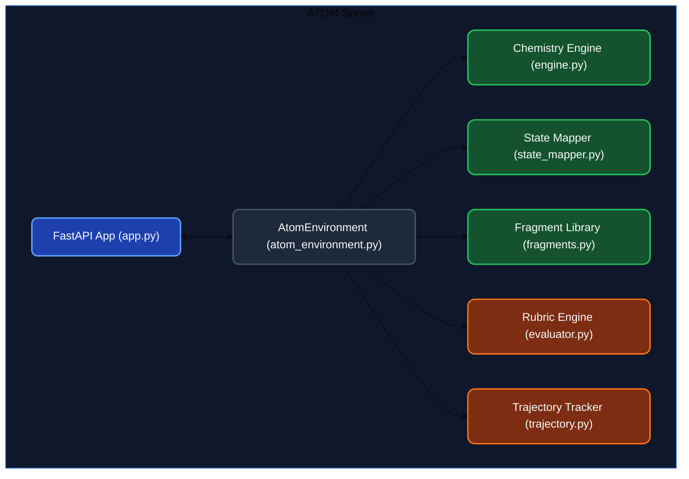

<div align="center">
  

# ATOM Environment Server
</div>

This directory contains the core implementation of the ATOM (Agentic Trajectories for Optimizing Molecules) reinforcement learning environment, adhering to the OpenEnv specification. The server is responsible for maintaining the state of the chemical optimization process, executing molecular actions via RDKit, evaluating trajectory progress, and providing an OpenEnv-compliant API interface for LLM agents.


## Architecture Overview

The ATOM server simulates a multi-objective medicinal chemistry lead optimization workflow using a combination of **FastAPI** (for the OpenEnv compliant endpoints) and **RDKit** (for the cheminformatics engine).

The key components are separated into domain-specific modules for clean separation of concerns and maintainability.




### System ASCII Architecture

```text
┌─────────────────────────────────────────────────────────────┐
│                      ATOM OpenEnv Server                    │
│                                                             │
│  ┌──────────────┐   ┌───────────────┐   ┌────────────────┐  │
│  │  Task Engine  │──▶│ Chemistry Eng │──▶│ Rubric Engine  │  │
│  │  (4 Tasks /   │   │ (RDKit Core)  │   │ (Graders,      │  │
│  │   TPP Defs)   │   │               │   │  0.0-1.0 Score)│  │
│  └──────────────┘   └───────────────┘   └────────────────┘  │
│                           │ ▲                   │           │
│  ┌────────────────────────▼─┴───────────────────▼────────┐  │
│  │              Dynamic State-Mapping Layer               │  │
│  │       (Translates LLM site_ids ↔ RDKit indices)       │  │
│  └───────────────────────────────────────────────────────┘  │
│                           │ ▲                               │
│  ┌────────────────────────▼─┴────────────────────────────┐  │
│  │             OpenEnv FastAPI Wrapper                    │  │
│  │         reset()  ·  step()  ·  state()                │  │
│  │        (HTTP + WebSocket, Port 8000)                   │  │
│  └───────────────────────────────────────────────────────┘  │
└───────────────────────────┬─▲───────────────────────────────┘
                      HTTP / WebSocket
                            │ │
                       LLM Agents
```

### 1. The OpenEnv Server Wrapper (`app.py` & `atom_environment.py`)

- **`app.py`**: A FastAPI application that exposes the required OpenEnv HTTP/WebSocket endpoints (`/step`, `/reset`, `/state`). It uses OpenEnv's `create_app` factory to support concurrent multi-agent WebSocket sessions. This allows multiple agents to train or evaluate against the environment simultaneously in isolation.
- **`atom_environment.py`**: Implements the core `Environment` class defined by the OpenEnv spec. It orchestrates the entire simulation lifecycle:
  - Validates `AtomAction` and constructs `AtomObservation` Pydantic models.
  - Updates the internal episode `State` and step counts.
  - Delegates chemical operations to the `Chemistry Engine`.
  - Interfaces with the `RubricEngine` to provide immediate directional feedback and final trajectory scoring.
  - Manages dynamic task generation (Task 999) when custom scaffolds and TPPs are requested.

### 2. Chemistry Engine (`chemistry/`)

This module is the scientific heart of ATOM, wrapping RDKit to provide valid, reproducible cheminformatics.

- **`engine.py`**: The core RDKit wrapper. It handles computational chemistry operations:
  - Computes molecular properties (QED, LogP, Molecular Weight, Synthetic Accessibility Score) directly from the underlying molecular graph.
  - Features advanced 3D conformer generation utilizing the MMFF94 force field to compute and optimize for 3D spatial stability/strain energy.
  - Performs rigorous valency checks to prevent the creation of impossible chemical structures (e.g., Texas Carbons).
  - Identifies PAINS, BRENK, and NIH structural alerts to penalize undesirable sub-structures.
  - Calculates Lipinski Rule of 5 violations to assess general drug-likeness.
  - Supports `mutate_atom` capabilities (e.g., swapping a Carbon for a Nitrogen in an aromatic ring) for advanced scaffold morphing.
  - Applies fragments using either Mode 1 (R-group attachment) or Mode 2 (indexed atom attachment).
- **`state_mapper.py`**: The Dynamic State-Mapping Layer. Because LLMs struggle with raw graph topological indices (which shift unpredictably when atoms are added or removed), this layer translates RDKit's internal atom indices into plain-English spatial descriptions (e.g., "Aromatic carbon adjacent to Nitrogen"). It supports attachments to any atom (Organic or Inorganic) with a free hydrogen. This enables the LLM to select a stable `site_id` effectively without suffering from "indexing hell".
- **`fragments.py`**: Contains the enterprise-grade curated library of 77+ medicinally relevant fragments (halogens, polar groups, aliphatic chains, cycloalkanes, heterocycles, and fused ring systems) as well as inorganic/metalloid groups (boronic acids, silanes, phosphates). It utilizes procedural generation on startup to exhaustively expand homologous series (e.g., alkyl chains) and validates all structures with RDKit.

### 3. Rubrics & Graders (`rubrics/`)

- **`evaluator.py`**: Defines the 4 escalating difficulty tasks (Benzene, Toluene, Kinase inhibitor, and Build-from-Scratch/Carbon). Contains the deterministic grading logic that evaluates the final molecule against the Target Product Profile (TPP). It uses Gaussian proximity functions to provide smooth, continuous, non-sparse rewards (partial credit for being close to a target).
- **`trajectory.py`**: Tracks the episode's history. The scoring rubric doesn't just evaluate the final state; it evaluates the agent's optimization trajectory. It rewards monotonic progress, penalizes erratic property inversions, scores step efficiency (using exponential decay to discourage grinding), and evaluates exploration diversity (encouraging the use of diverse chemical motifs).

## How it Works (The Execution Loop)

The typical flow for an agent interacting with the ATOM server is:

1. **Initialization (`/reset`)**: The agent initiates an episode, specifying a `task_id` (1-4) or providing a dynamic custom scaffold. The environment initializes the molecular graph, computes baseline properties, clears trajectory history, and returns the initial `AtomObservation`.
2. **Site Enumeration (`/step` with `get_valid_sites`)**: The agent usually queries the environment first to understand what can be modified. The `StateMapper` analyzes the molecule, finds all valid C-H (or heteroatom-H) bonds, generates plain-text topological descriptions, and returns an array of valid `site_id`s in the observation.
3. **Modification (`/step` with `add_fragment`, `mutate_atom`, or `remove_group`)**: The agent submits an action proposing a structural change.
   - The environment validates the action against the fragment library and RDKit valency constraints.
   - If valid, the underlying molecular graph is mutated.
   - All properties (LogP, QED, SA_Score, MW, Energy) are recomputed.
   - The trajectory tracker logs the step, noting if it improved or degraded the molecule relative to the TPP.
   - An updated observation is returned with directional text feedback (e.g., "Modification successful. QED improved by +0.05.").
4. **Completion (`/step` with `finish` or max steps reached)**: The episode concludes. The `RubricEngine` analyzes the full step-by-step trajectory, calculating a final composite score `0.0 - 1.0` based on Target Adherence (40%), Trajectory Quality (25%), Step Efficiency (15%), Chemical Validity (10%), and Exploration Diversity (10%).

## Setup and Local Development

### Prerequisites

- Python 3.10+
- `uv` package manager (recommended) or `pip`

### Installation

1. Navigate to the root directory of the ATOM repository.
2. Install the necessary dependencies. We use `uv` for fast dependency resolution.

```bash
# Using uv (recommended)
uv pip install -r server/requirements.txt
uv pip install openenv-core fastapi uvicorn rdkit

# Or using pip
pip install -r server/requirements.txt
pip install openenv-core fastapi uvicorn rdkit
```

### Running the Server Locally

To start the FastAPI server:

```bash
# Run the FastAPI server via uvicorn
python server/app.py
```

The server will bind to `0.0.0.0:8000`.

### Available Endpoints

The server exposes standard OpenEnv endpoints:

- **`POST /reset`**: Initialize a new episode. Accepts a JSON payload with `task_id` or dynamic task definitions. Returns an initial observation.
- **`POST /step`**: Submit an action. Accepts a JSON payload matching the `AtomAction` Pydantic model. Returns an updated observation and the step reward.
- **`GET /state`**: Retrieve the current episode state, step count, and current property snapshot without advancing the environment.
- **`GET /health`**: Standard health check returning a 200 OK.

## Adding Custom Fragments

To extend the fragment library, modify `server/chemistry/fragments.py`.

You can add manual entries to the `FRAGMENTS` dictionary using the `Fragment` dataclass:

```python
Fragment("NewGroup", "CC(=O)N", "[*]-CC(=O)N", "Acetamide group, H-bond donor and acceptor")
```

Or write a procedural generator function (like `_generate_aliphatic_chains()`) and ensure it runs before `_validate_and_clean()`. All new fragments are automatically validated for chemical feasibility by RDKit upon server startup; invalid fragments will be silently pruned.

## Testing

To run the internal server test suite covering chemistry validity, API contracts, and grader determinism:

```bash
pytest tests/
```
